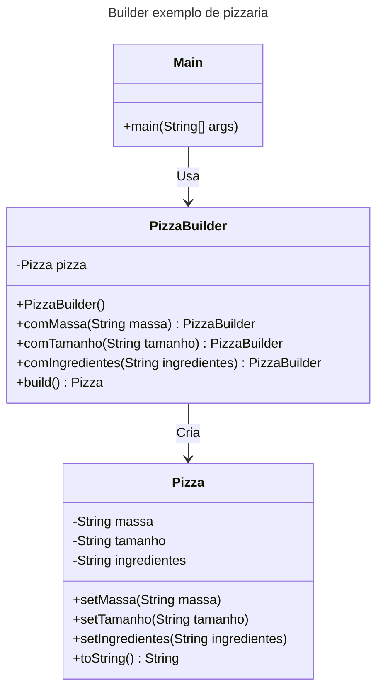

## Motivação
Imagine que você está criando um sistema para montar pizzas personalizadas. Cada pizza pode ter diferentes tipos de massa, tamanhos e ingredientes. O padrão Builder ajuda a organizar a criação dessas pizzas, separando a lógica de montagem dos detalhes específicos de cada pizza. Isso facilita a criação de diferentes combinações sem duplicar código.

## Estrutura

## Participantes
- **Pizza (Produto)**: Representa a pizza que será construída. Ela tem atributos como tipo de massa, tamanho e ingredientes.

- **PizzaBuilder (Builder)**: Responsável por montar a pizza passo a passo. Ele tem métodos para definir a massa, o tamanho e os ingredientes, e retorna o próprio builder para permitir chamadas encadeadas (fluent interface).

- **Main (Cliente)**: No método main, usamos o PizzaBuilder para criar uma pizza personalizada. O método build finaliza a construção e retorna a pizza pronta.
